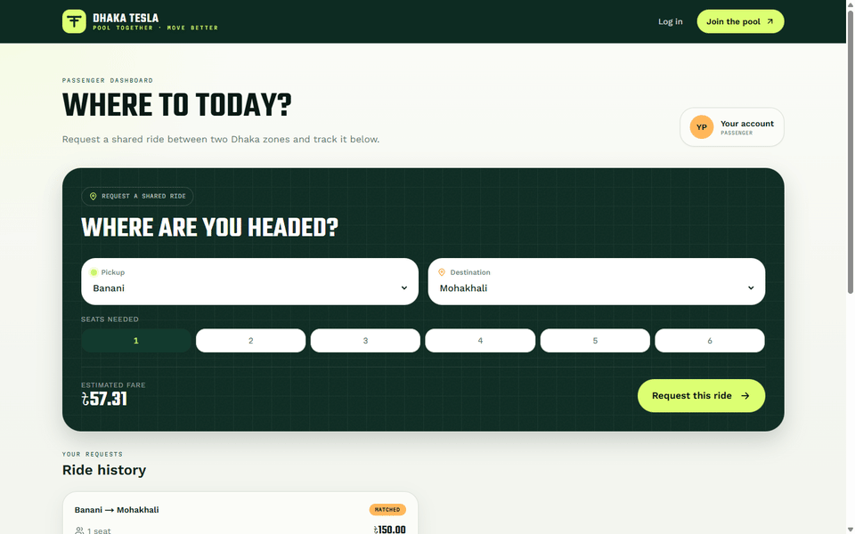
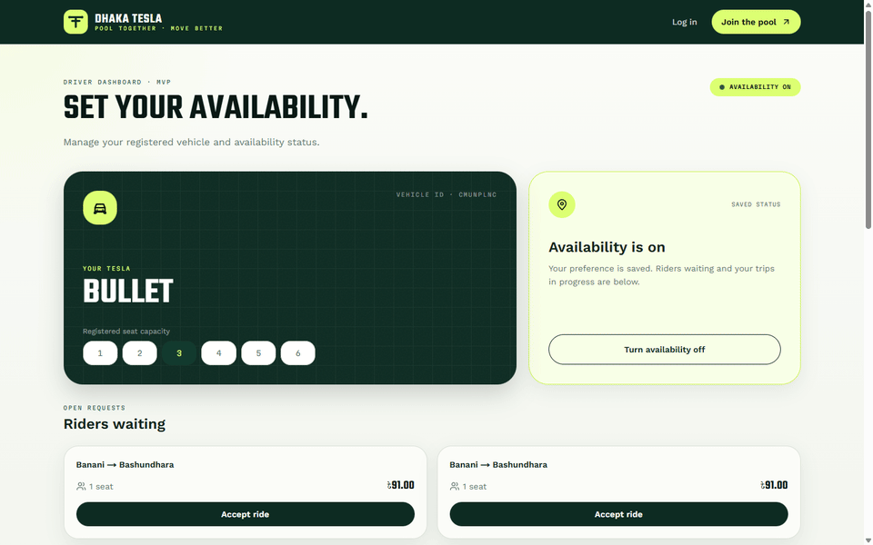
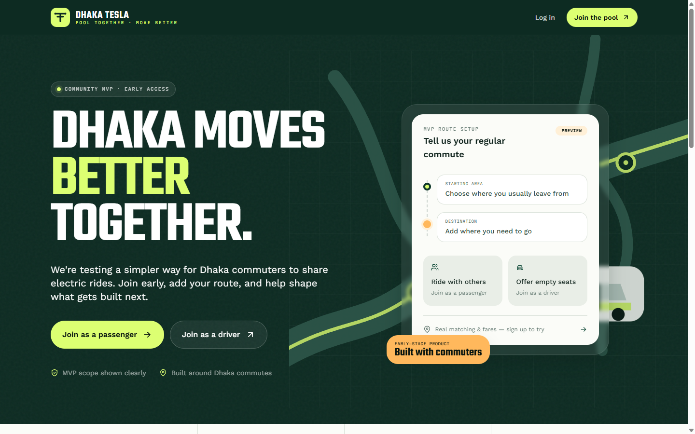
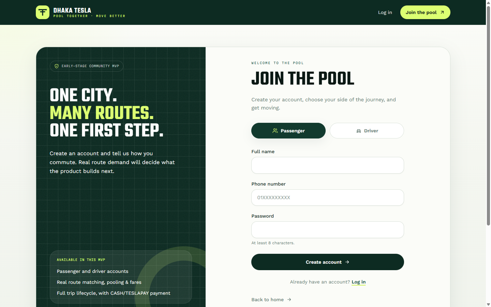
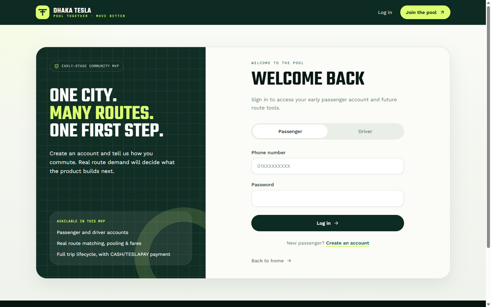
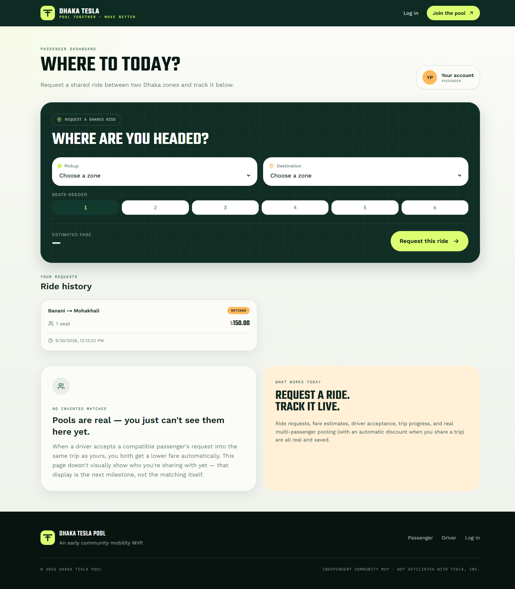
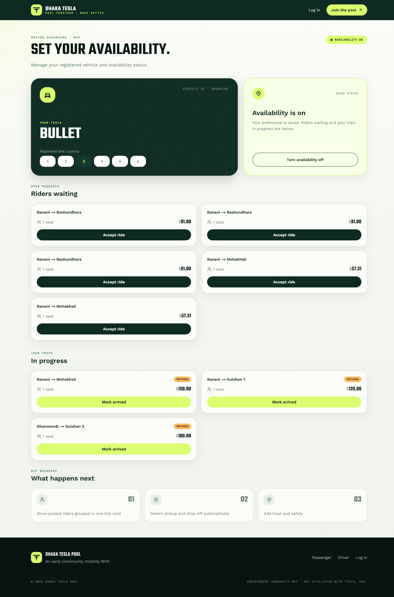
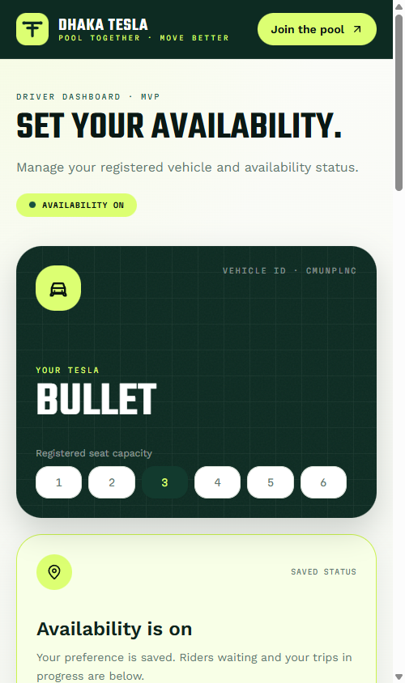
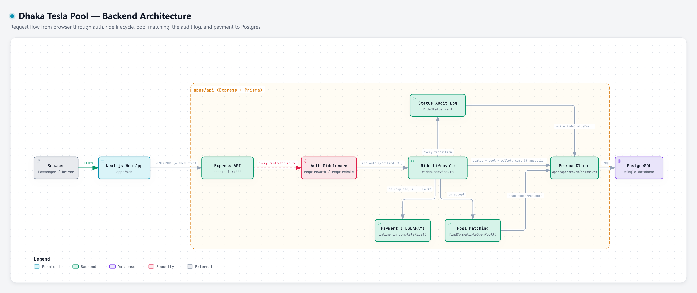
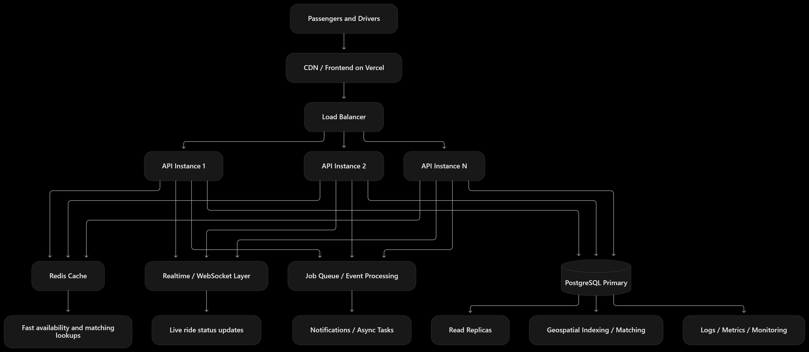

# Dhaka Tesla Pool

Ride-pooling MVP for shared Tesla rides across Dhaka. Built as a technical
assessment submission.

## Summary

A ride-pooling backend and frontend for a small fleet of Teslas in Dhaka.
A passenger requests a ride between two zones and gets a live fare
estimate; a driver accepts it, which either founds a new shared pool or
joins the passenger into a compatible one already open on that driver's
own Tesla, with a 15% discount for whoever joins. The driver progresses
the ride through arrival, start, and completion; every attempted status
change — including a losing side of a concurrency race — is written to
an append-only audit log; and on completion, a `TESLAPAY` request
atomically deducts its fare from a simulated wallet, rejecting the
completion outright if the balance won't cover it. All of this is real
and running, not a mockup — see "Screenshots / GIFs" below for it in
action.

## Problem statement

Dhaka ride-hailing is dominated by single-passenger trips, which is
expensive per rider and wasteful of seat capacity on routes many
commuters already share. This MVP scopes the problem down to something
answerable in an assessment timeframe: a **small, fixed fleet** of
Teslas (not a general driver marketplace), **simple proximity-based
pooling** (pickup-to-pickup and destination-to-destination within a
fixed radius, not route-optimization or ML-based matching), and
**one driver's own accept action** as the only place a pool ever forms
(not a dispatch layer deciding which of several online drivers should
get a request). Those three simplifications are what make "does pooling
actually work, correctly, under concurrency" answerable at all in this
scope — see "Key decisions/trade-offs" and "Next improvements" below for
what a production version would need instead.

## Features implemented

- Passenger and driver auth (signup/login, JWT)
- Driver vehicle registration + online/offline status
- Ride requests with a live fare estimate
- Full ride lifecycle: `REQUESTED → MATCHED → DRIVER_ARRIVED → STARTED →
  COMPLETED`/`CANCELLED`, with concurrency-safe conditional writes
- **Real multi-passenger pooling**: accepting a request joins a compatible
  existing pool when one exists (route-matched, capacity-checked,
  race-safe) or founds a new one — see "Matching, fare, and concurrency"
  below
- Driver-facing pool view (`GET /rides/pools/mine`): full passenger list
  per pool, not just one ride at a time
- Driver-flow: online/offline actually gates new-request matching (not
  just a stored flag), a single-pool detail view, and driver ride/pool
  history — see "Driver-flow decisions" below
- Status audit log: every attempted status transition, including the
  losing side of a concurrency conflict, readable back per-ride and
  per-pool — see "Status audit log" below
- Payment: `CASH`/`TESLAPAY` per ride request, with atomic wallet
  deduction (and a rejected completion on insufficient balance) for
  `TESLAPAY` — see "Payment" below

## Screenshots / GIFs

All captured live against the running app (real Next.js frontend, real
Express API, real Postgres) via the chrome-devtools MCP tooling — not
mockups. GIFs are built from real captured frames of actual state
transitions (`ffmpeg`, no re-enactment).

**Passenger: requesting a ride, live fare estimate**



Selecting pickup/destination computes a real fare estimate
(`৳57.31` for Banani → Mohakhali) before submission; changing seats to 2
recomputes it live (`৳114.62`, exactly double); submitting adds a new
`REQUESTED` card to ride history immediately, no reload.

**Driver: online/offline gating and the full ride lifecycle**



Toggling availability off empties "Riders waiting" instantly (in-progress
trips stay untouched, per the "Driver-flow decisions" section above);
toggling back on brings requests back with no manual refresh; accepting a
request and progressing it through `driver-arrived → start → complete`
updates each card's status and button in place, and a completed trip
correctly drops out of "In progress."

**Landing, auth, and dashboards**

| | |
|---|---|
|  Landing page |  Signup |
|  Login |  Passenger dashboard |
|  Driver dashboard |  Driver dashboard, 390px mobile width |

Full-resolution passenger dashboard and a 390px-wide passenger dashboard
capture (confirming the mobile-first, single-column collapse required by
`apps/web/DESIGN.md`) are also in
[`docs/screenshots/`](docs/screenshots/).

A caught-and-fixed note: capturing these screenshots surfaced two stale
"not built yet" claims in the frontend copy (the landing page's hero card
and the auth pages' sidebar) — both said matching/pooling were upcoming
when they'd actually been merged weeks earlier. Fixed before these
screenshots were taken; see `docs/ai-usage-notes.md`.

## Architecture diagram + ERD



Full request-flow diagram (interactive version, plus source citations) in
[`docs/architecture.md`](docs/architecture.md); entity-relationship diagram
in [`docs/erd.md`](docs/erd.md).

## Tech stack & justification

| Layer      | Choice                          | Why |
|------------|----------------------------------|-----|
| Frontend   | Next.js (App Router) + TypeScript | Modern React with file-based routing and built-in API-friendly conventions. |
| Backend    | Node.js + Express + TypeScript   | Minimal, explicit control over routing/middleware for a small REST surface. |
| ORM        | Prisma                          | Type-safe queries + migrations against Postgres. |
| Database   | PostgreSQL                      | Relational integrity for users/pools/requests; strong Prisma support. |
| Validation | zod                              | Runtime validation + static types from one schema. |
| Auth       | JWT (jsonwebtoken + bcryptjs)     | Stateless auth suitable for a small API, simple to reason about for an assessment. |
| Testing    | Jest + supertest (backend)       | Standard, fast HTTP-level testing for Express routes. |

Deeper trade-off reasoning for specific choices (money-as-integer,
one-Tesla-per-driver, etc.) is in "Key decisions/trade-offs" below.

## Project structure

```
apps/
  api/            Express + TypeScript API
    src/
      config/     env parsing/validation
      db/         Prisma client
      common/     shared middleware/errors
      modules/    feature modules (routers, services, tests)
    prisma/       schema + seed
  web/            Next.js (App Router) frontend
    app/
docs/             architecture, ERD, fare model notes
docker-compose.yml
```

## Prerequisites

- Node.js 20+
- npm 10+
- Docker + Docker Compose (for the full stack)

## Environment variables

Copy `.env.example` to `.env` and adjust as needed:

```
cp .env.example .env
```

See [`.env.example`](.env.example) for the full list (Postgres credentials,
`DATABASE_URL`, `JWT_SECRET`, `PORT`, `NEXT_PUBLIC_API_URL`).

## Local setup

```bash
npm install
npm run prisma:generate
npm run prisma:migrate
npm run prisma:seed
npm run dev:api    # in one terminal
npm run dev:web    # in another terminal
```

## Docker instructions

```bash
cp .env.example .env
docker compose up --build
```

This starts Postgres (with a healthcheck), the API, and the web app, wired
together via `.env`. Web: http://localhost:3000, API: http://localhost:4000.

**Running Prisma migrate/seed against the dockerized Postgres from the
host** (e.g. to apply a new migration without rebuilding the `api`
container): `docker compose up postgres` starts only the database,
exposed on the host at the port in `.env` (`POSTGRES_PORT`, default
`5432`). From the host, with `apps/api` as the working directory and
`DATABASE_URL` pointed at `localhost` rather than the in-network
`postgres` hostname (`.env`'s own comment on `DATABASE_URL` explains
this host-vs-container distinction), run `npx prisma migrate dev` and
`npx prisma db seed` directly — no need to rebuild or restart the `api`
container for a schema change, since it's the same physical database
either way. This is exactly how every migration in this repo's history
was applied and verified.

## Migration/seed instructions

```bash
npm run prisma:migrate   # apply schema to the database
npm run prisma:seed      # load demo data (Jashim + Bullet + 3 passengers)
```

## Running tests

```bash
npm run test:api
```

## Demo credentials

All seeded users share the same demo password: `password123`

| Name   | Role      | Phone         |
|--------|-----------|---------------|
| Jashim | DRIVER    | 01700000001   |
| Nusrat | PASSENGER | 01700000002   |
| Rafiq  | PASSENGER | 01700000003   |
| Shirin | PASSENGER | 01700000004   |

## Deployment URL

Not deployed — this submission runs locally only (see "Local setup" /
"Docker instructions" above). No deployment URL to give honestly; not
listing a fake one here.

## API overview

Every route below requires `Authorization: Bearer <token>` except
`POST /auth/signup`, `POST /auth/driver-signup`, `POST /auth/login`, and
`GET /zones`. Identity is always derived from the verified JWT
(`req.auth.sub`/`req.auth.role`), never trusted from the request body —
see `apps/api/src/common/auth-middleware.ts`.

| Method & path | Role | What it does |
|---|---|---|
| `POST /auth/signup` | — | Create a passenger account; returns a JWT |
| `POST /auth/driver-signup` | — | Create a driver account **and** its Tesla in one transaction; returns a JWT |
| `POST /auth/login` | — | Log in (passenger or driver); returns a JWT |
| `GET /zones` | — | List all pickup/destination zones |
| `GET /drivers/me` | Driver | This driver's own registered Tesla (id, label, capacity, `isOnline`) |
| `PATCH /drivers/me/status` | Driver | Set `isOnline` — see "Driver-flow decisions" below for what this actually gates |
| `POST /rides/request` | Passenger | Create a ride request; returns an *estimated* fare. Optional `paymentMethod` (`CASH`/`TESLAPAY`, defaults `CASH`) |
| `GET /rides/mine` | Passenger | This passenger's own requests, with live status |
| `PATCH /rides/:id/cancel` | Passenger | Cancel (allowed from `REQUESTED`/`MATCHED`/`DRIVER_ARRIVED`) |
| `GET /rides/available` | Driver | "Relevant requests" — pending (`REQUESTED`) requests, system-wide; empty if this driver is offline |
| `POST /rides/:id/accept` | Driver | Accept a request — joins a compatible open pool on this driver's own tesla, or founds a new one; finalizes `farePaisa`; rejected (409) if this driver is offline |
| `PATCH /rides/:id/driver-arrived` | Driver | `MATCHED → DRIVER_ARRIVED` |
| `PATCH /rides/:id/start` | Driver | `DRIVER_ARRIVED → STARTED`; locks the pool |
| `PATCH /rides/:id/complete` | Driver | `STARTED → COMPLETED` |
| `GET /rides/driver-mine` | Driver | This driver's own requests, flat list |
| `GET /rides/pools/mine` | Driver | This driver's own pools, each with its **full passenger list** (pickup/destination/status/fare per passenger) |
| `GET /rides/pools/:id` | Driver | Single-pool detail with full passenger list; 403/404 if it isn't this driver's pool |
| `GET /rides/pools/history` | Driver | This driver's completed (and, if ever reached, cancelled) pools, most recent first |
| `GET /rides/:id/history` | Passenger (owner) | Every attempted status transition for one ride, oldest first — see "Status audit log" below |
| `GET /rides/pools/:id/history` | Driver (owner) | Every attempted status transition across every request that has belonged to this pool, oldest first |

## Ride lifecycle

```
REQUESTED → MATCHED → DRIVER_ARRIVED → STARTED → COMPLETED
```

`CANCELLED` is reachable from `REQUESTED`, `MATCHED`, or `DRIVER_ARRIVED` —
**not** from `STARTED`. A trip that's already moving isn't a "never
happened" cancellation anymore; once a driver has pressed Start, the only
way forward is Complete. This is enforced in one place,
[`isValidTransition`](apps/api/src/common/rideLifecycle.ts), and every
endpoint that changes a `RideRequest`'s status goes through it rather than
hand-rolling its own check — including `PATCH /rides/:id/cancel`, which
additionally verifies the caller is the request's own passenger (403
otherwise) before checking whether the current state is one of the three
cancellable ones.

**Why `GET /rides/mine` returns a passenger's full history in one list**,
rather than a separate history endpoint the way the driver side has
(`GET /rides/pools/history`): this is a deliberate simplification, not an
oversight. A driver accumulates many pools over an open-ended career, so
splitting "active" from "history" keeps that list usable. A passenger's
own request list is naturally small — a handful of rides at most for this
MVP — so one chronological list (most recent first, active and completed
and cancelled together) is simpler for a passenger to scan than two tabs
would be, with nothing lost. If passenger ride volume ever grew large
enough that this stopped being true, splitting it would be the same
change already made for drivers, not a new pattern to invent.

### Status audit log

Every attempted status transition — accept, cancel, driver-arrived, start,
complete — is recorded as a `RideStatusEvent` row: `fromStatus`,
`toStatus`, who did it (`actorUserId`/`actorRole`), and an `outcome` of
`SUCCESS` or `CONFLICT`. "Attempted" is the operative word: a losing side
of a concurrency conflict (e.g. the second of two drivers racing to accept
the same request, or the second of two passengers racing for the last
seat in a pool) is logged too, with `outcome: CONFLICT` — not just the
write that actually won. That's what makes this useful as a concurrency
audit trail, not just a status-change log.

The two outcomes are written differently, and that difference is
deliberate rather than an inconsistency:

- A `SUCCESS` row is inserted **inside the same transaction** as the write
  it describes (the same `$transaction` that flips the request's status
  and, where relevant, claims a pool seat or locks the pool). If any part
  of that transaction fails, the event never lands either — it can never
  describe a write that didn't actually happen.
- A `CONFLICT` row **cannot** live inside that transaction, by definition:
  the transaction that hit the conflict rolled back, so nothing written
  inside it — an event row included — could have survived. It's written
  as a separate, immediate insert right after the conflict is detected,
  in a `catch` block outside the aborted transaction.

Two read endpoints expose the log: `GET /rides/:id/history` (a passenger
reading their own ride's timeline; 403 for anyone else's) and
`GET /rides/pools/:id/history` (a driver reading every event across every
request that's ever belonged to one of their pools; 403 for another
driver's pool). Both use the same ownership pattern as the existing
`PATCH /rides/:id/cancel` and `GET /rides/pools/:id` endpoints.

One scoping note: the log only records races caught by the app's own
conditional writes (`updateMany` returning `count === 0`) — not every
early-rejection 409, like calling `/start` on a request that's still
`REQUESTED`. That kind of rejection is a caller mistake against
already-known state, not a race against a concurrent write, and nothing
actually happened to the resource for an event to describe.

## Matching, fare, and concurrency (pooling)

Full detail lives in dedicated docs — this is the map:

- **Matching rule**: [`docs/geography-and-matching.md`](docs/geography-and-matching.md).
  Two ride requests are compatible when pickup-to-pickup distance is
  ≤ 1.5 km *and* destination-to-destination distance is ≤ 3 km, checked
  against a pool's fixed "anchor" (the first request that founded it) —
  reused unchanged from `feature/geography-zones`, now actually wired
  into pool assignment for the first time by
  [`pool-matching.ts`](apps/api/src/modules/rides/pool-matching.ts).
- **Fare model**: [`docs/fare-model.md`](docs/fare-model.md).
  Per-passenger `baseFare + distanceCharge`, with a 15% pool discount for
  a passenger who *joins* an existing pool (not for the one who founds
  it). Worked example with Nusrat and Rafiq's real trips is in that doc.
- **Concurrency**: every write that changes a `RideRequest`'s status or a
  `Pool`'s `seatsTaken` uses a conditional `updateMany` keyed on the value
  just read, checking `result.count === 0` to detect a lost race, instead
  of a naive read-then-write. This is the same fix already applied across
  the ride lifecycle (`cancelRideRequest`, `acceptRideRequest`,
  `markDriverArrived`, `startRide`, `completeRide` — see the commit
  history on `feature/ride-lifecycle`), extended here to pool seat
  claiming: joining a pool is `pool.updateMany({ where: { id, status:
  "OPEN", seatsTaken: { lte: capacity - seats } }, data: { seatsTaken: {
  increment: seats } } })`, so two passengers racing for the last seat
  can't both win. Multi-table writes (seat claim + request link; request
  status + pool lock) run inside `prisma.$transaction` so they commit or
  roll back together — a losing accept never leaves an orphaned pool or a
  request linked to a pool whose seat was never actually claimed. Verified
  both with an automated concurrent-request test and live, firing two
  truly simultaneous accepts at a real Postgres database.

## Payment

Each `RideRequest` has a `paymentMethod` (`CASH` or `TESLAPAY`, defaults
to `CASH`, chosen by the passenger at request time), and each `User` has
a simulated `walletBalancePaisa` — there's no real payment gateway, no
top-up endpoint, and no payment UX beyond that one field, deliberately,
per the assessment's scope. **Insufficient wallet balance rejects the
completion** rather than letting the ride complete unpaid: on
`PATCH /rides/:id/complete`, if the request's method is `TESLAPAY`, the
fare is deducted from the passenger's wallet with a conditional
`updateMany` (`WHERE walletBalancePaisa >= farePaisa`) inside the exact
same transaction as the `COMPLETED` status flip — if the balance doesn't
cover the fare, that `updateMany` matches zero rows, the whole
transaction (status flip, pool update, wallet deduction alike) rolls
back, and the endpoint returns `402` instead of a ride that finished
without being paid for. `CASH` skips the wallet check entirely and just
records the chosen method. Demo passengers are seeded with a starting
balance in `prisma/seed.ts` so `TESLAPAY` is actually exercisable without
a top-up flow.

## Driver-flow decisions

Two assumptions made building `feature/driver-flow`, stated explicitly
because both are things a reviewer would reasonably ask to have defended:

**Assumption 1 — "relevant requests" means all unmatched requests
system-wide, not zone-filtered.**
`GET /rides/available` (a driver's "relevant requests" list) returns
every currently `REQUESTED` ride request, with no location or zone
filtering. *Why:* nothing in the schema tracks a driver's location or a
registered "zone" for a driver — `Tesla` has no `lat`/`lng`, and
`docs/geography-and-matching.md` already documents "driver location: not
modeled" as a deliberate simplification for passenger-to-passenger
matching. Filtering "relevant" by driver zone would mean inventing a new
concept (a driver's registered zone) and a new schema field for it,
which wasn't asked for and would need its own design pass (what happens
when a driver's actual location drifts from their "registered" one?).
The simpler option — show everything, let the driver pick — is what the
existing data actually supports, so that's what's implemented. No
geography beyond passenger-to-passenger compatibility (the pickup/
destination proximity rule in `pool-matching.ts`) exists anywhere in
this codebase.

*Where the `isOnline` gate actually lives:* the original task assumed
`pool-matching.ts`'s matching function would need an `isOnline` filter
added to "candidate pools/drivers." It doesn't — `findCompatibleOpenPool`
never selects a driver; it only searches the *specific* driver's own
already-open pools, and that driver is already known because they're the
one calling `POST /rides/:id/accept`. There's no candidate-drivers query
to filter there. The real enforcement point is `acceptRideRequest`
itself (rejects with 409 if `tesla.isOnline` is false, before any
matching runs), plus `listAvailableRideRequests` returning nothing to an
offline driver so the UI doesn't show requests they can't act on.

**Assumption 2 — going offline never touches a pool already in
progress.**
Toggling `isOnline` off only stops this driver from being able to
`accept` *new* requests (`acceptRideRequest` now checks it, 409 if
offline). It does **not** cancel, lock, or otherwise touch any pool this
driver is already driving — `markDriverArrived`, `startRide`, and
`completeRide` don't check `isOnline` at all, so a driver can toggle
offline mid-trip (e.g. right after picking up their last rider for the
day) and still finish that trip normally. *Why:* "offline" models
"stop giving me new work," not "abandon what I'm already doing" — a
driver mid-pool has real passengers physically expecting to be dropped
off; silently stranding them because a status toggle was flipped would
be a correctness bug, not a feature. Verified directly: a driver who
goes offline after accepting a request can still call driver-arrived,
start, and complete on that same request (`test(driver): cover
online/offline gating and mid-trip continuity`).

## Key decisions/trade-offs

- **Money is always an integer count of paisa (`farePaisa`,
  `walletBalancePaisa`), never a float or decimal.** Floating-point
  arithmetic on money invites rounding drift that compounds silently
  across many small transactions — a fare computed as `57.31` today and
  `57.309999999999995` after a different code path touches it is exactly
  the kind of bug that's invisible in a demo and real in production.
  Storing the smallest currency unit as a plain integer (the same pattern
  Stripe and most payment systems use) makes every arithmetic operation
  exact, and `formatPaisa` on the frontend is the one place paisa becomes
  a decimal-display string, not the other way around.
- **One Tesla per driver** (`Tesla.driverId` is `@unique`), not a
  driver-owns-many-vehicles model. The assessment scope is "a small fleet
  of Teslas," and every endpoint that resolves "this driver's vehicle"
  (`getOwnTesla`, `acceptRideRequest`, `listAvailableRideRequests`, etc.)
  is simpler and unambiguous when there's exactly one Tesla to find
  instead of a fleet-selection step nothing in the spec asked for. A
  driver managing multiple vehicles is a real feature, just not this
  one's.
- **Matching, fare model, and concurrency approach**: see "Matching, fare,
  and concurrency (pooling)" above and the linked docs for the full
  reasoning behind each.
- **Pool creation is driver-scoped, not automatic at request time**: a
  brand-new `Pool` always requires a specific `Tesla`, so matching only
  ever runs inside a driver's own `POST /rides/:id/accept` — never
  automatically at `POST /rides/request`, which would require inventing
  a "which online driver gets this" rule the assessment spec didn't
  define. This was confirmed as a deliberate scope decision before
  building, not assumed.
- **No fare rebalancing on join**: see `docs/fare-model.md`'s "Known
  asymmetry" section.

## Known limitations

- Pooling only ever considers a single driver's own open pools — there's
  no cross-driver "best available pool" ranking. A passenger's request
  can only join a pool on whichever driver happens to accept it.
- A pool's fare for its founding passenger never adjusts after someone
  else joins and starts saving (see `docs/fare-model.md`).
- The frontend does not yet visually group multiple passengers sharing
  one pool — `GET /rides/pools/mine` exists on the backend, but the
  driver dashboard UI still renders a flat per-request list
  (`GET /rides/driver-mine`). Flagged, not silently left unmentioned.

## Next improvements

### At scale

- **Matching lookup cost.** `findCompatibleOpenPool` scans every OPEN
  pool for one driver, in-process, one at a time. Fine at MVP scale (one
  driver has a handful of open pools at most); at real scale this needs
  either a spatial index (e.g., PostGIS, or bucket zones into a grid) so
  compatibility candidates come from a database query instead of an
  application-level loop, or a background matching service instead of
  synchronous per-accept computation.
- **Fare fairness**, per `docs/fare-model.md`: rebalance every active
  member's fare on each join rather than only discounting the joiner, and
  communicate re-quoted fares to already-matched passengers.
- **Cross-driver matching.** Right now a passenger only ever pools with
  whichever specific driver accepts their request. At scale, the more
  useful question is "which pool, across every online driver, is the best
  match" — that needs a dispatch/ranking layer, not just a per-driver
  accept action.
- **Concurrency at higher write volume.** The conditional-`updateMany`
  pattern holds up fine at MVP request rates, but under heavy concurrent
  load on a single hot pool, repeated 409-and-retry cycling becomes real
  contention. At scale this points toward either short-lived row-level
  locking (`SELECT ... FOR UPDATE`) around the seat-claim step, or a
  queue/serialization point per pool so accepts against the same pool
  don't all race the database simultaneously.

## Bonus: "If Dhaka Tesla Pool Goes Viral" — scaling to 1M passengers, 100k drivers

Not built — this is reasoning about what would actually change, not a
rewrite of the MVP. The point of this section is the trade-offs, not the
box count, so each topic below says what breaks first and why, using
this codebase's actual patterns as the starting point rather than
generic scaling boilerplate.



**Load balancing & horizontal scaling.** The MVP's biggest structural
advantage here is one it already has for free: `requireAuth` derives
identity entirely from a verified JWT (`req.auth.sub`/`req.auth.role`),
and no route keeps server-side session state. That statelessness is
what makes "add more API instances behind a load balancer" actually
trivial instead of a rewrite — any instance can serve any request.
Horizontal scaling is a deploy-config change (more containers, an LB
health check), not an architecture change.

**Database indexing & read replicas.** At MVP scale, Prisma's default
indexes (primary keys, the `@unique` constraints on `Tesla.driverId` and
`User.phone`) are enough. At 1M passengers, the hot lookup paths need
explicit composite indexes — `Pool(teslaId, status)` for the open-pool
scan in `findCompatibleOpenPool`, `RideRequest(status)` for the
"relevant requests" query, `RideRequest(poolId, status)` for pool
detail/history. Reads (`GET /rides/mine`, `GET /rides/pools/history`,
`GET /zones`) split off to read replicas; every write (`accept`,
`cancel`, the lifecycle transitions) stays on the primary, since those
all depend on the conditional-`updateMany` pattern's read-your-own-write
guarantee — a replica lagging by even a few hundred ms would reintroduce
exactly the race conditions this MVP already fixed.

**Caching.** `GET /zones` is close to static reference data (nine fixed
Dhaka zones) and is the easiest, highest-value cache: Redis with a long
TTL, invalidated only on the rare admin edit. A driver's `isOnline` flag
is a good second candidate — it's read on every matching-relevant
request but only written on toggle. Ride/pool state itself is a worse
caching candidate: it changes on every lifecycle step and any staleness
directly risks a double-accept, which is the one failure mode this MVP
was built specifically to prevent.

**Geospatial search.** This is the one that most changes shape. The MVP
deliberately scans a single driver's own OPEN pools in-process
(`pool-matching.ts`, already documented as an MVP simplification in
"Next improvements" above) — fine when one driver has a handful of open
pools, not fine when the question becomes "which of 100k online
drivers, anywhere in Dhaka, has a compatible pool." That needs a real
spatial index — PostGIS `ST_DWithin`/a geohash or H3-bucketed lookup
table — so compatible candidates come back from one indexed query
instead of an application loop over every driver's pools.

**Queues & events.** Every mutation today is synchronous request →
response, including the two side effects that don't need to be on the
critical path: the `RideStatusEvent` audit write (already isolated
inside the same DB transaction as the state change, so it's cheap) and
any future notification fan-out (push to the matched driver, push to
the passenger on status change). At scale, notification delivery moves
to a queue (SQS/similar) consumed by a separate worker — a slow push
provider should never make `POST /rides/:id/accept` itself slow.

**Real-time communication.** The current frontend is poll-based — see
`DriverRideActions`'s `refreshKey` prop, which triggers a manual refetch
of `/rides/available` and `/rides/driver-mine` after a driver's
availability toggle (this was a real bug fixed earlier in this project:
the UI didn't refetch on its own). Polling every few seconds is fine at
MVP scale; at 1M passengers it's 1M clients hammering the API on a
timer. That's exactly the shape WebSockets/SSE exist for — replace the
poll with a per-user channel the server pushes to on actual state
changes, which also lowers perceived latency ("Mark arrived" showing up
instantly instead of on the next poll tick).

**Rate limiting.** Needed at two levels: per-IP at the edge (basic abuse
protection) and per-user on specific mutating endpoints — especially
`POST /rides/:id/accept`, which is already this codebase's known
concurrency hotspot (the Nusrat/Shirin last-seat race, documented and
tested above). A driver or script hammering accept in a tight loop
shouldn't be able to turn that hotspot into a denial-of-service against
one pool.

**Idempotency.** Distinct from the concurrency-safety this MVP already
has. The conditional-`updateMany` pattern stops two *different* actors
from both winning a race — it does nothing to stop the *same* client
from double-submitting `POST /rides/request` after a timeout on a flaky
mobile connection (a legitimate retry, not a race). That needs a
client-supplied idempotency key stored against the created resource, so
a retried request with the same key returns the original result instead
of creating a second ride request.

**Observability.** The `RideStatusEvent` log (`outcome: SUCCESS |
CONFLICT`, see "Status audit log" above) is a genuinely useful head
start most MVPs don't have — it's already a queryable business-event
log, not just an access log. At scale, the natural extension is
alerting directly on it: a spike in `CONFLICT` rate for one pool is a
live signal of real contention, not something you'd need a separate APM
tool to notice. Add on top of it: distributed tracing (OpenTelemetry)
across the API → queue → DB path, structured logs shipped to a central
aggregator, and dashboards for p99 latency and queue depth.

**DB contention.** Already flagged above under "Next improvements": the
conditional-`updateMany` pattern (every status/seat-count write in this
codebase) holds up fine at MVP request rates but degrades under heavy
concurrent load on one hot pool, where repeated 409-and-retry cycling
becomes real contention. At scale that points toward either short-lived
row-level locking (`SELECT ... FOR UPDATE`) around the seat-claim step,
or a queue/serialization point per pool so accepts against the same
pool don't all race the database at once.

**Ride matching at scale.** Today a passenger only ever pools with
whichever specific driver happens to accept their request — there's no
cross-driver ranking (also already flagged above). At 1M passengers,
"which pool, across every online driver in range, is the best match"
becomes the real question, and answering it synchronously inside one
HTTP request stops being reasonable. That's a dispatch/ranking service
fed by the geospatial index above, likely computed by a background
matching worker rather than inline in `acceptRideRequest`.

**Retry/failure strategy.** Two different problems, worth keeping
separate: async work (queued notifications, matching jobs) needs
dead-letter queues and exponential backoff so a permanently-failing job
doesn't retry forever or silently vanish; client-facing writes need the
idempotency-key strategy above so a client's own retry is safe. Payment
is a special case worth naming explicitly: `completeRide`'s wallet
deduction is already atomic (one DB transaction, conditional on balance)
rather than a multi-step saga, and that doesn't change at scale — it's
still one row's balance and one row's status, just under more
concurrent load, so it's the DB-contention problem above, not a new
distributed-transaction problem.

**Security.** The foundation is already the right shape: identity
always comes from a verified JWT, never from the request body (the
`requireAuth`/`requireRole` rule this whole project follows), and input
is validated with zod at every boundary. At scale, add short-lived
access tokens with refresh rotation (today's JWTs don't expire
aggressively), a WAF/DDoS layer at the edge in front of the load
balancer, and secret rotation for the DB and JWT signing keys. The
`RideStatusEvent` audit log also does double duty here — it's already a
forensic trail of who did what to which resource, which is exactly what
a security incident review needs.

**Deployment strategy.** `apps/api` already has a `Dockerfile` and this
repo already documents a container-based local workflow
(`docker-compose.yml`, see "Docker instructions" above) — at scale that
same image is what runs behind the load balancer, N-times horizontally,
with rolling or blue-green deploys instead of the single-container
restart this MVP uses. Database migrations stay a deliberate, separate
step from app deployment (already true today — see "Running Prisma
migrate/seed against the dockerized Postgres from the host" above), not
something that runs automatically on every container start, since a
migration and a code deploy failing independently is much easier to
reason about than both failing together.

## AI Usage

Written from [`docs/ai-usage-notes.md`](docs/ai-usage-notes.md), an
append-only log kept *as things happened* through the whole build, not
reconstructed from memory afterward. That file has the full detail (31
entries); this section is the summary the assessment asks for.

**Tools.** Claude Code for scaffolding, backend (Express/Prisma/zod/JWT),
frontend (Next.js/Tailwind), tests, git workflow, and live verification
against a real Postgres instance throughout. Impeccable (a Claude Code
design plugin) for early homepage/auth-page visual direction and a
mechanical design-quality detector. Archify for the source-cited
architecture diagram. The chrome-devtools MCP tools for the screenshots
and GIFs above, and for one live in-browser bug repro. Codex, separately,
redid the entire frontend visual system after the Impeccable-driven
direction didn't land (see "rejected" below).

**One accepted suggestion.** The `requireAuth`/`requireRole` middleware
(`apps/api/src/common/auth-middleware.ts`) — one shared pattern that
verifies the JWT and derives identity from `req.auth`, never from a
request body or param, built once on `feature/driver-auth` and flagged
at the time as more important than that branch's actual feature,
specifically so every later authenticated route (ride requests, pooling,
audit log, payment) would reuse it instead of reimplementing per-route
auth with subtly different bugs each time. It worked: every one of those
later endpoints does reuse it, and the rule is now codified in
`CLAUDE.md` as a standing project constraint.

**One rejected/changed suggestion.** The homepage's first visual pass
used generic Tailwind defaults with no real direction — rejected
("looks horrendous"). The correction overcorrected, flooding the page
with a solid green background — rejected again. The direction that
actually shipped only emerged after two rounds of the AI optimizing for
"technically has a design system" over "actually looks considered."
Separately, and larger in scope: the whole Impeccable-tool-driven design
process across several pages (a formal critique cycle, a written
direction contract, a matching `DESIGN.md`) was rated 2/10 by the user
after a further revision pass and replaced outright with a different
tool's (Codex) redesign — a different visual system entirely, which is
what's live today. Recorded plainly rather than omitted: a whole
tool-driven approach was tried with real process behind it and still
didn't land, which is a legitimate outcome to disclose, not a failure to
hide.

**Bugs the AI introduced, caught before or after shipping.** A phone-
number validation regex that rejected real, validly-formatted numbers
(no tolerance for spacing, dashes, or a `+880` prefix) until normalized
first. A same-zone ride request (`Gulshan 1 → Gulshan 1`) silently
charged the full base fare because a same-zone guard was deliberately
scoped out as "keep simple" — caught by the user actually trying the
product, then found to be *incompletely* fixed (the backend rejected it,
but a separate frontend fare-preview code path kept showing a fare for
the same broken input). A test mock's `findUnique` returned a live
object reference instead of a snapshot (unlike real Prisma), silently
mutating a value the service still held after a later write — caught by
a failing assertion, fixed in both the mock and the service code
defensively. Several stale "not built yet" claims in frontend copy
(dashboard cards, the landing page's hero card, the auth pages' sidebar)
that undersold features which had actually shipped on a merged branch —
caught three separate times across the project, most recently while
capturing the screenshots above.

**Bugs/gaps the AI caught, not introduced.** A causal overclaim in
`docs/geography-and-matching.md` implying the matching rule had produced
the seed data's pool grouping, when that grouping was hand-authored
before the matching code existed. A concurrency race in every one of
`feature/ride-lifecycle`'s status-mutating endpoints, overlooked on a
first pass and then found and fixed with tests before merge. A
methodology bug in the AI's own live-verification approach — the first
attempt to reproduce a last-seat concurrency race with backgrounded
`curl` processes failed to reproduce it at all, because subprocess
overhead serialized the requests past the actual race window; switched
to firing both requests from a single Node process via `Promise.all`,
which reliably reproduced the race. A design tension in this session's
own audit-log spec: it asked for a losing concurrency conflict to be
logged "in the same transaction" as the write it lost — impossible by
construction, since a transaction that fails rolls back everything
written inside it, an event row included. Resolved by splitting
SUCCESS (co-committed with its write) from CONFLICT (a separate insert
after the transaction rolls back) rather than silently doing the
literal-but-impossible version and dropping every CONFLICT row.

## Demo video link

Not recorded — see "Screenshots / GIFs" above for the equivalent: real
captured GIFs of the passenger request flow and the full driver
lifecycle, built from actual browser state, not a scripted recording.
