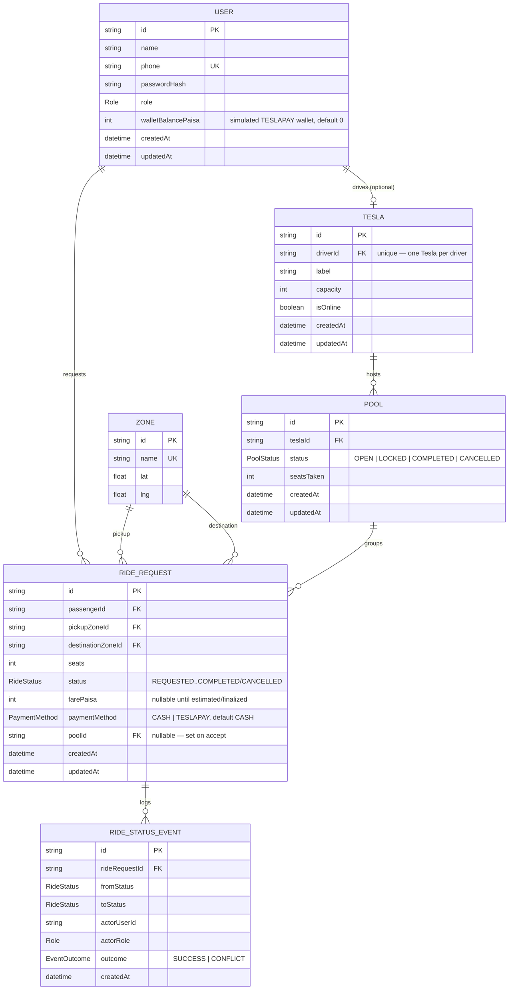

# Entity Relationship Diagram

Generated by hand from [`apps/api/prisma/schema.prisma`](../apps/api/prisma/schema.prisma)
as it stands on `master`/`feature/payment`. Renders natively on GitHub.

## Notes on cardinality and constraints not expressible in Prisma

- **One Tesla per driver** is enforced by `Tesla.driverId` being `@unique`,
  not by the ERD's `||--o|` alone — Prisma doesn't have a native
  driver-role-only constraint, so nothing stops a `PASSENGER`-role `User`
  from theoretically having a `Tesla` row at the schema level. In practice
  this never happens because only `POST /auth/driver-signup` creates a
  `Tesla`, and it always creates the `User` as `DRIVER` in the same
  transaction — see `apps/api/src/modules/auth/auth.service.ts`.
- **`Pool.seatsTaken` never exceeds `Tesla.capacity`** — enforced entirely in
  application code (`acceptRideRequest`'s conditional `pool.updateMany` with
  `seatsTaken: { lte: capacity - seats }`), not by a database constraint.
  See the main README's "Matching, fare, and concurrency" section.
- **`RideRequest.status` transitions follow a fixed state machine**
  (`REQUESTED → MATCHED → DRIVER_ARRIVED → STARTED → COMPLETED`, with
  `CANCELLED` reachable from the first three only) — enforced by
  `isValidTransition` in `apps/api/src/common/rideLifecycle.ts`, not by a
  Postgres check constraint.
- **`RideStatusEvent` is append-only** — nothing in the schema prevents an
  `UPDATE`/`DELETE` against it, but no service code ever issues one; every
  write is a `create`. See the main README's "Status audit log" section for
  why a `CONFLICT` row can't share a transaction with the write it failed to
  make.
- **`walletBalancePaisa` deduction never goes negative** — enforced by the
  conditional `user.updateMany` with `walletBalancePaisa: { gte: farePaisa }`
  in `completeRide`, not a `CHECK (walletBalancePaisa >= 0)` constraint.
